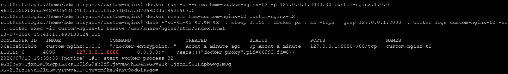
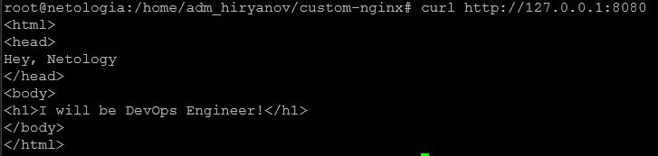

### Задача 1

https://hub.docker.com/repository/docker/mhiriyanov/custom-nginx/general

### Задача 2





### Задача 3


Контейнер остановился потому что была передана команда Ctrl+C, которая отсановила главный процесс контейнера. Когда завершается процесс, контейнер останавливается.


Процесс ngins после команды ```nginx -s reload``` начал слушать порт 81, при этом docker продолжает отправлять трафик на порт 80.

Решить проблему можно через порт форвардинг:

```iptables -t nat -A OUTPUT -p tcp -d 127.0.0.1 --dport 8080 -j REDIRECT --to-ports 81```


### Задача 4

Запустите первый контейнер из образа centos c любым тегом в фоновом режиме, подключив папку текущий рабочий каталог $(pwd) на хостовой машине в /data контейнера, используя ключ -v.


Запустите второй контейнер из образа debian в фоновом режиме, подключив текущий рабочий каталог $(pwd) в /data контейнера.


Подключитесь к первому контейнеру с помощью docker exec и создайте текстовый файл любого содержания в /data.


Добавьте ещё один файл в текущий каталог $(pwd) на хостовой машине.


Подключитесь во второй контейнер и отобразите листинг и содержание файлов в /data контейнера.


### Задача 5
2. Отредактируйте файл compose.yaml так, чтобы были запущенны оба файла. (подсказка: https://docs.docker.com/compose/compose-file/14-include/)


3. Выполните в консоли вашей хостовой ОС необходимые команды чтобы залить образ custom-nginx как custom-nginx:latest в запущенное вами, локальное registry. Дополнительная документация: https://distribution.github.io/distribution/about/deploying/


6. Перейдите на страницу "http://127.0.0.1:9000/#!/2/docker/containers", выберите контейнер с nginx и нажмите на кнопку "inspect". В представлении <> Tree разверните поле "Config" и сделайте скриншот от поля "AppArmorProfile" до "Driver"
   

